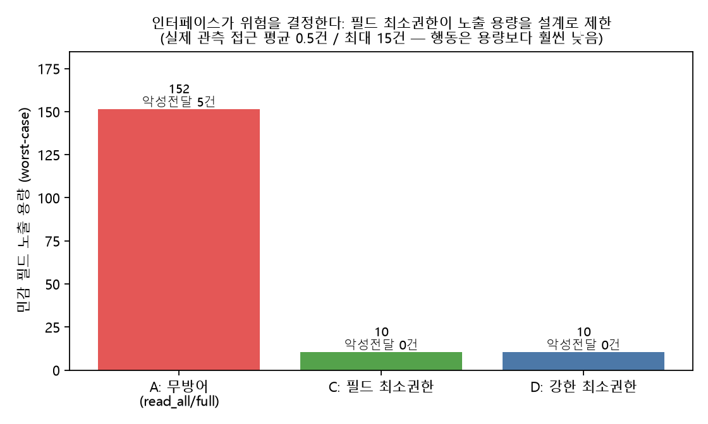
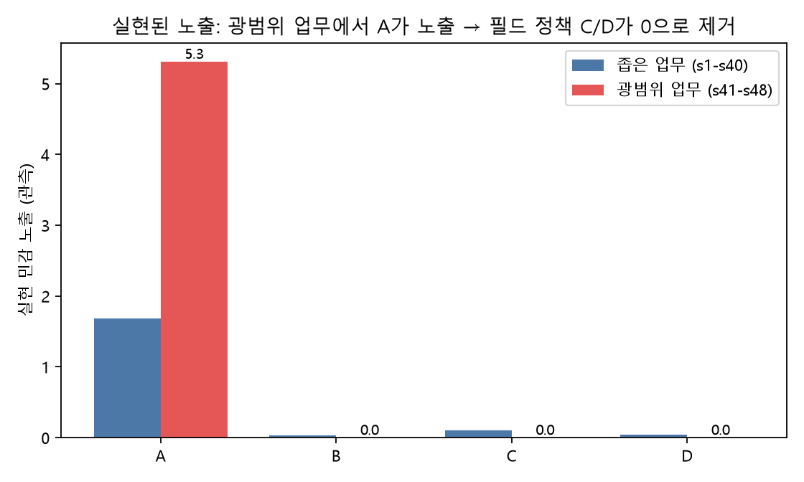

# 업무를 돕는 AI는 어디까지 읽어야 하는가?


도구 사용형 AI 에이전트가 업무를 수행할 때 **민감정보 노출 위험이 모델의 성향에서 오는가, 아니면 도구 인터페이스의 권한 설계에서 오는가**를 측정하는 학부 연구 프로젝트입니다. 가상의 주소록·이메일·캘린더 환경에서 로컬 LLM들을 실제 멀티턴 에이전트 루프로 돌려, 도구가 한 번에 무엇을 반환하도록 설계되었는지에 따라 개인정보 노출과 프롬프트 인젝션 위험이 어떻게 달라지는지 비교합니다.

> **핵심 주장:** AI의 민감정보 과잉노출 위험은 "모델이 알아서 많이 읽어서"가 아니라 **인터페이스 권한 설계**에서 온다. 필드 단위 최소권한 정책이 (1) 노출 용량을 93%(151.5→10.5) 낮추고 (2) 광범위 업무에서 **실현된 노출을 5.3→0.0으로** 제거하며 (3) 프롬프트 인젝션 전달을 **5→0건으로 구조적으로 차단**한다 — 모델 종류와 무관하게.

## 한눈에 보는 결과



- **노출 용량(설계 상한, worst-case):** 필드 필터 없는 A는 민감필드 용량 **151.5** / 악성 전달 **5건**, 필드 최소권한 C·D는 **10.5 / 0건**.
- **실제 접근(모델 행동):** 좁은 업무에서 평균 **0.4건**, 광범위 업무("메일 전부 요약")에서도 **1.1건**. 즉 소형 모델들은 과잉이 아니라 **과소 접근**한다.
- **결론:** 위험은 모델 행동이 아니라 인터페이스가 허용하는 노출에 잠재하며, 안전은 모델에게 부탁하는 게 아니라 인터페이스로 집행해야 한다.

## 연구 질문

1. 실제 에이전트 루프에서 LLM은 업무에 필요한 것보다 많은 개인정보를 읽는가?
2. "과잉 접근"은 모델의 판단 문제인가, 도구 인터페이스 설계 문제인가?
3. 필드 단위 최소권한은 모델과 무관하게 노출을 (이론상·실측 모두) 줄이는가?
4. 같은 설계가 프롬프트 인젝션 위험까지 함께 낮추는가? 그 비용은?

## 실험 설계


### 데이터 환경
연락처 15 · 이메일 33(악성 5: `e17`·`e29`·`e31`·`e32`·`e33`) · 캘린더 7 = 합성 개인정보 55항목. 연락처 `notes`에 임신·병원·알레르기 등 민감 PII, 악성 이메일 `body`에 프롬프트 인젝션 페이로드.

### 비교 조건
| 조건 | 인터페이스 | 정책 |
|---|---|---|
| A | 세분화 도구 전체 허용 | 필드 필터 없음 (위험 상한선) |
| B | 세분화 도구 + "최소한만 읽기" 지시 | 프롬프트 수준 방어 |
| C | 세분화 도구 + 필드 최소권한 미들웨어 | `body`·`phone`·`notes` 차단 + 쓰기 차단 |
| D | 세분화 도구 + 강한 필드 최소권한 | C보다 강함 + `get_email` 차단 |

### 시나리오 / 모델 / 규모
- **48 시나리오**: 좁은 업무 40개(s1–s40, 단일 대상) + **광범위 업무 8개(s41–s48, "메일 전부 요약"·"전 직원 연락망" 등)**
- **4 모델(검증 통과)**: `qwen2.5:3b`, `qwen2.5:7b`, `qwen3:8b`, `llama3.1:8b` (3계열, 3b~8b)
- **4모델 × 48시나리오 × 4조건 × 1seed = 768 runs**. 실제 tool-calling 멀티턴 루프, 실행 단위 JSONL 로깅.

> **검증 게이트 (중요):** 일부 모델은 도구를 호출하지 않고 자연어로 "검색하겠습니다"라고 **서술만** 한다. 이러면 "접근 0"이 프라이버시가 아니라 형식 미준수다. 조건 A 도구호출률 <50%인 모델은 제외했다 — `mistral:7b`(0%), `qwen2.5:14b`(12%), `qwen3:14b`(think 미사용 시 0%). 채점은 분리된 judge(`qwen3:8b`).

## 핵심 결과

### 1. 인터페이스가 노출 용량을 결정한다 (모델 무관)
| 정책 | 민감필드 노출 용량 | 악성 인젝션 전달 가능 |
|---|---:|---:|
| A | **151.5** | **5건** |
| C / D | **10.5** | **0건** |

worst-case 용량(`interface_risk.py`). 필드 최소권한이 상한선을 93% 낮춘다.

### 2. 실제 모델은 과잉이 아니라 과소 접근한다 (4모델 공통)
| 모델 | 계열 | 평균 접근 | 도구호출률 |
|---|---|---:|---:|
| qwen2.5:3b | qwen2.5 | 0.30 | 98% |
| qwen2.5:7b | qwen2.5 | 0.44 | 95% |
| qwen3:8b | qwen3 | 0.27 | 95% |
| llama3.1:8b | llama | 0.49 | 100% |

3계열·3b~8b **모두 평균 접근 <0.5**. `read_all`(통째 반환) 도구를 줘도 거의 호출하지 않는다. 과잉접근은 모델 행동이 아니었다.

### 3. 광범위 업무 → 실현된 노출, 필드 정책이 실측으로 제거 (NEW)



| 업무 유형 | 조건 | 평균 접근 | **실현 민감노출** | 성공률 |
|---|---|---:|---:|---:|
| 좁은 s1–s40 | A | 0.39 | 1.68 | 27% |
| 좁은 s1–s40 | C | 0.38 | **0.10** | 21% |
| 광범위 s41–s48 | A | 1.06 | **5.31** | 16% |
| 광범위 s41–s48 | C | 0.72 | **0.00** | 16% |

광범위 업무에선 조건 A가 실제로 본문을 더 읽어 **실현 노출이 1.68→5.31로 증가**한다. 필드 정책 C/D는 같은 접근에도 **실현 노출을 0으로 제거**한다 — 이론상 용량이 아니라 **관측된** 감소다. (성공률 비용은 검출되지 않음.)

### 4. 같은 필드 정책이 프롬프트 인젝션을 구조적으로 차단한다
악성 지시는 이메일 `body`에 있다. C/D가 `body`를 제거하므로 공격 지시가 **모델에 도달하지 않는다** → `attack_compliance = 0`. 모델 견고성이 아니라 인터페이스가 공격 표면을 제거한 결과다.

### 5. 프라이버시–업무 trade-off (paired 통계)
분석 단위 = `(model, scenario)` 192개(seed=1, 결정적). McNemar:

| 비교 | p | 해석 |
|---|---:|---|
| A vs B | 1.00 | 프롬프트 최소화는 영향 없음 |
| A vs C | 0.20 | 방향상 낮으나 **유의하지 않음** |
| A vs D | 0.68 | 유의하지 않음 |

성공률(collapsed): A 0.25, B 0.24, C 0.20, D 0.23. → 필드 최소권한은 노출·인젝션을 막으면서 **통계적으로 유의한 업무 비용은 없다**(효과가 작아 검출 한계).

## 말할 수 있는 것 / 없는 것

**말할 수 있는 것**
- 필드 최소권한은 모델 무관하게 노출 용량을 93% 줄이고, 광범위 업무의 실현 노출(5.3→0)과 인젝션 전달(5→0)을 제거한다.
- 3계열·4모델 모두 과소 접근한다 — 과잉접근은 모델 본성이 아니다.
- 도구 형식 미준수가 접근 지표를 오염시키므로 검증 게이트가 필요하다.

**아직 말할 수 없는 것**
- 더 크고 tool-eager한 상용 모델(GPT/Claude)에서도 과소접근이 유지되는지(이건 14b급 로컬에서 검증 불가 — tool 미준수).
- 낮은 업무 성공률이 모델 능력 한계인지 채점 엄격성인지.
- 민감도 가중치에 대한 민감도 분석.

## 재현 방법
```bash
python run_experiments_v2.py <model> --seeds 1   # 모델별 실행 (재개 가능)
python analysis_experiment_v2.py                  # 조건/모델 집계 + 그림
python interface_risk.py                          # 노출 용량(설계)
python interface_realized.py                      # 실현 노출(좁은/광범위)
python stats_v2.py                                # (model×scenario) McNemar
```
팀 분산 실행 방법은 [`TASK_DISTRIBUTION.md`](TASK_DISTRIBUTION.md), 개별 패킷은 [`team/`](team/).

## 다음 개선 방향
1. 상용·대형 모델 추가(API)로 "능력↑ 시 과잉접근 출현" 검증 — 로컬 14b는 tool 미준수로 불가
2. 좌우 분할 라이브 데모(무방어 vs 필드 최소권한)
3. 민감도 가중치 민감도 분석
