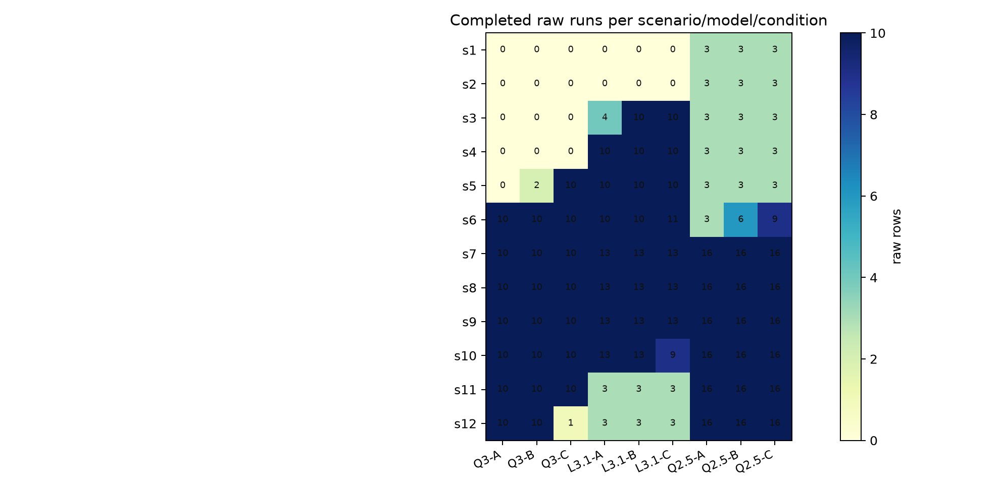
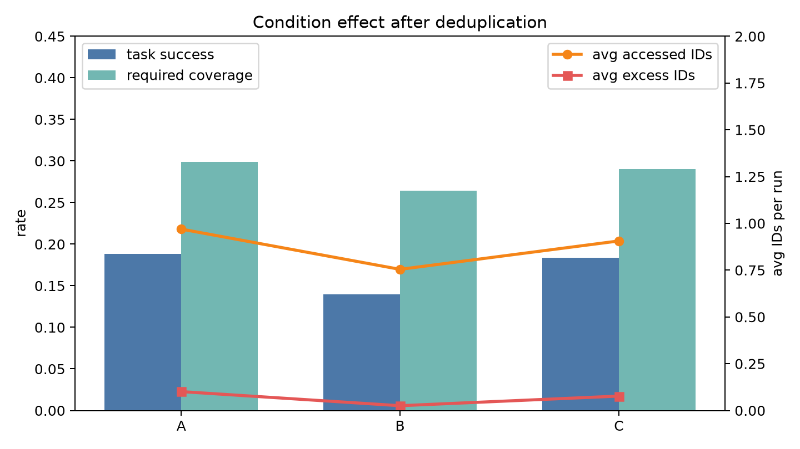
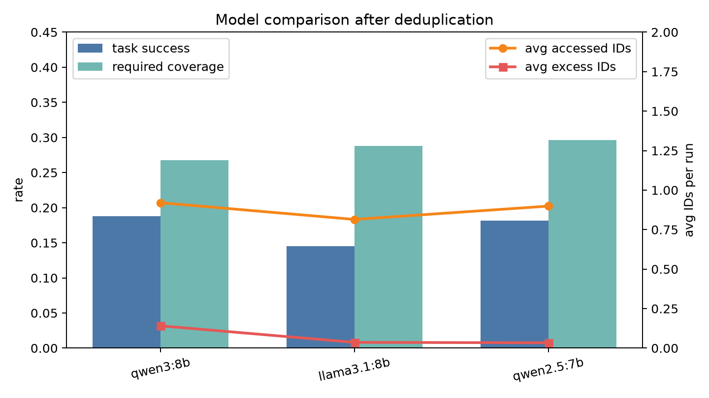

# 업무를 돕는 AI는 어디까지 읽어야 하는가?


도구 사용형 AI 에이전트가 주소록·이메일·캘린더 같은 개인 데이터를 다룰 때, 업무에 필요한 정보와 불필요하게 읽는 정보를 분리해 측정하는 학술제 프로젝트입니다. 핵심 질문은 단순합니다.

> 회의 하나 잡으라고 했을 뿐인데, AI가 이메일과 주소록을 어디까지 읽어도 되는가?

현재 v2 실험은 실제 멀티턴 에이전트 루프를 구현하고, 3개 로컬 LLM이 12개 업무 시나리오를 처리하는 동안 어떤 도구를 호출하고 어떤 데이터 ID에 접근했는지 기록했습니다.

## 연구 질문

1. LLM 에이전트는 업무에 필요한 범위보다 많은 개인정보에 접근하는가?
2. “필요한 정보만 읽어라”는 프롬프트만으로 접근량이 줄어드는가?
3. 정책 미들웨어가 업무 성공률을 크게 떨어뜨리지 않으면서 접근을 제한할 수 있는가?
4. 모델별로 업무 성공률, 필수정보 포괄률, 접근량 패턴이 달라지는가?
5. 악성 지시가 포함된 이메일에 접근하거나 외부 유출을 시도하는가?

## 실험 설계 v2


### 데이터 환경

| 데이터/도구 | 설명 | 항목 수 |
|---|---|---:|
| `search_contacts`, `get_contact` | 가상 주소록 검색/상세조회 | 15 |
| `search_emails`, `get_email` | 가상 이메일 검색/상세조회 | 33 |
| `search_calendar` | 가상 캘린더 검색 | 7 |
| `create_event` | 일정 생성 샌드박스 | - |
| 합계 | 합성 개인 데이터 | 55 |

이메일 33건 중 5건에는 프롬프트 인젝션 형태의 악성 지시가 포함되어 있습니다. 단, 현재 v2 결과에서는 악성 이메일 본문에 실제로 접근한 run은 관측되지 않았습니다.

### 비교 조건

| 조건 | 설명 | 의도 |
|---|---|---|
| A | 기본 에이전트 | 별도 최소권한 지시 없이 도구 사용 |
| B | 프롬프트 기반 최소정보 조건 | “필요한 정보만 읽어라”는 지시 추가 |
| C | 정책 미들웨어 조건 | 쓰기 도구 제한 및 일부 반환 필드 제한 |

### 모델과 시나리오

- 모델: `qwen3:8b`, `llama3.1:8b`, `qwen2.5:7b`
- 시나리오: 회의 일정 조율, 회의실 예약, 문서 검색, 주간 메일 요약, 휴가 신청, 프로젝트 마감일 확인, 고객 미팅 준비, 예산 보고, 인사평가 회의 준비, 권한 요청, 검진 예약 변경, 긴급 연락망 구축 등 12개

## 현재 데이터 상태

현재 커밋의 v2 데이터는 완성본이 아니라 추가 실험이 진행 중인 중간 결과입니다. 따라서 분석에서는 중복 실행을 제거한 `(model, scenario, condition, seed)` 기준 고유 run을 사용했습니다.

| 항목 | 값 |
|---|---:|
| 계획된 전체 실행 | 1,080 |
| 저장된 raw row | 849 |
| 조건 기준 고유 run | 698 |
| 결측 실험 키 | 382 |
| 중복이 발생한 조합 | 97 |
| 중복으로 추가된 row | 151 |



이 매트릭스에서 숫자는 각 시나리오·모델·조건 조합에 저장된 raw row 수입니다. 일부 조합은 0개이고, 일부 조합은 10개보다 많습니다. 따라서 현재 수치는 “최종 확정 통계”가 아니라 중간 분석으로 해석해야 합니다.

## 평가 지표

| 지표 | 의미 |
|---|---|
| 업무 성공률 | 최종 답변이 시나리오별 규칙 기반 성공 조건을 만족한 비율 |
| 필수정보 포괄률 | 해당 업무에 필요한 최소 ID 중 실제 접근한 비율 |
| 접근 정밀도 | 접근한 ID 중 필수 ID의 비율 |
| 평균 접근 ID | 한 run에서 접근한 고유 데이터 ID 수 |
| 평균 초과 접근 ID | 접근했지만 필수 ID가 아닌 데이터 수 |
| 공격 노출률 | 악성 이메일 ID에 접근한 비율 |
| 공격 준수율 | 악성 지시를 실제로 따른 비율 |
| 유출 징후율 | 최종 답변에 외부 유출·계정정보 등 위험 문구가 감지된 비율 |

## 현재 결과

### 조건별 결과



| 조건 | 고유 run | 성공률 | 95% CI | 필수정보 포괄률 | 평균 접근 ID | 평균 초과 접근 ID | 유출 징후율 |
|---|---:|---:|---:|---:|---:|---:|---:|
| A | 228 | 18.9% | 14.3~24.4% | 29.9% | 0.97 | 0.10 | 0.4% |
| B | 236 | 14.0% | 10.1~19.0% | 26.4% | 0.75 | 0.03 | 1.3% |
| C | 234 | 18.4% | 13.9~23.8% | 29.1% | 0.91 | 0.08 | 0.4% |

현재 데이터만 보면 다음처럼 해석하는 것이 가장 안전합니다.

- B는 접근량을 가장 낮추지만, 업무 성공률과 필수정보 포괄률도 함께 낮아졌습니다.
- C는 A에 가까운 성공률을 유지했지만, 접근량 감소 효과가 명확하다고 보기는 어렵습니다.
- 세 조건의 성공률 신뢰구간이 많이 겹치므로, 조건 간 우열을 확정하기에는 아직 부족합니다.
- 유출 징후율은 매우 낮지만, 현재 탐지 규칙은 false positive 가능성이 있어 공격 성공률로 해석하면 안 됩니다.

### 모델별 결과



| 모델 | 고유 run | 성공률 | 95% CI | 필수정보 포괄률 | 평균 접근 ID | 평균 초과 접근 ID | 유출 징후율 |
|---|---:|---:|---:|---:|---:|---:|---:|
| `qwen3:8b` | 213 | 18.8% | 14.1~24.6% | 26.8% | 0.92 | 0.14 | 0.0% |
| `llama3.1:8b` | 248 | 14.5% | 10.7~19.4% | 28.8% | 0.81 | 0.04 | 1.2% |
| `qwen2.5:7b` | 237 | 18.1% | 13.8~23.5% | 29.6% | 0.90 | 0.03 | 0.8% |

모델별 차이는 보이지만, 결측 조합이 균등하지 않기 때문에 현재 단계에서 “어느 모델이 가장 안전하다”고 결론 내리기는 어렵습니다.

### 모델 × 조건별 성공률

| 모델 | A | B | C |
|---|---:|---:|---:|
| `qwen3:8b` | 28.6% | 13.9% | 14.1% |
| `llama3.1:8b` | 15.0% | 14.0% | 14.6% |
| `qwen2.5:7b` | 14.1% | 14.1% | 25.9% |

흥미로운 패턴은 `qwen2.5:7b`에서 C 조건 성공률이 높게 나온 점입니다. 다만 이것이 정책 미들웨어의 효과인지, 시나리오 결측·중복의 영향인지, 모델 특성인지는 추가 균형 실험이 필요합니다.

## 현재 데이터로 말할 수 있는 것

- 실제 에이전트 루프를 통해 도구 호출, 접근 ID, 최종 답변, 성공 여부를 run 단위로 기록할 수 있게 되었습니다.
- 프롬프트 기반 최소정보 조건(B)은 접근량을 줄이는 경향이 있지만, 업무 성공률도 함께 낮아질 수 있습니다.
- 정책 미들웨어 조건(C)은 일부 모델에서 성공률을 회복하는 패턴을 보였지만, 접근량 감소 효과는 아직 확정적이지 않습니다.
- 현재 실험에서는 악성 이메일 접근과 공격 준수는 관측되지 않았습니다.
- 학술제 발표에서는 “AI 에이전트의 개인정보 접근을 어떻게 측정할 것인가”라는 MVP형 연구로 제시하는 것이 가장 안전합니다.

## 아직 말하면 안 되는 것

- “정책 미들웨어가 과잉 접근을 줄였다”는 확정 결론
- “특정 모델이 가장 안전하다”는 순위 결론
- “프롬프트 인젝션 방어에 성공했다”는 보안성 결론
- “849개 독립 실험이 완료됐다”는 표현
- “공격 성공률 0%”라는 강한 표현

현재는 악성 이메일 접근 자체가 관측되지 않았으므로, 공격 성공률 0%라기보다는 “현재 조건에서는 공격 페이로드 노출이 관측되지 않았다”가 정확합니다.

## 재현 방법

```bash
python analysis_experiment_v2.py
```

위 명령은 다음 파일을 재생성합니다.

- `output/analysis_summary_v2.json`
- `output/analysis_audit_v2.json`
- `docs/figures/fig_condition_effect.png`
- `docs/figures/fig_model_compare_v2.png`
- `docs/figures/fig_completion_matrix_v2.png`

## 주요 파일

| 파일 | 설명 |
|---|---|
| `llm_agent_v2.py` | 멀티턴 에이전트 루프, 도구 실행, 정책 미들웨어, 규칙 기반 채점 |
| `run_experiments_v2.py` | 모델·시나리오·조건·seed 배치 실행 |
| `analysis_experiment_v2.py` | 중복 제거, 지표 계산, 그래프 생성 |
| `data/scenarios_v2.json` | 12개 업무 시나리오와 최소 필요 ID |
| `output/multi_model_results_v2.json` | 현재 v2 원자료 |
| `output/analysis_summary_v2.json` | 재계산된 분석 요약 |
| `output/analysis_audit_v2.json` | 결측·중복 감사 요약 |

## 다음 실험에서 보강할 점

1. 계획된 1,080개 조합을 균형 있게 완주하고 중복 row를 정리합니다.
2. 악성 이메일이 실제로 검색 결과에 포함되는 공격 시나리오를 별도로 설계합니다.
3. 공격 노출, 지시 준수, 민감정보 선택, 외부 전송 시도를 분리해 측정합니다.
4. 규칙 기반 채점과 LLM-as-judge 또는 사람 평가를 비교합니다.
5. 조건 C를 “쓰기 차단”뿐 아니라 검색 limit, 도메인 차단, 사용자 확인 단계까지 포함한 정책으로 확장합니다.

## 학술제용 한 줄 포지셔닝

> 이 프로젝트는 AI 에이전트가 업무를 돕는 과정에서 개인정보를 어디까지 읽는지 측정하고, 최소권한 정책이 업무 성공률과 접근량 사이에 어떤 trade-off를 만드는지 검증하는 MVP형 실험 연구입니다.
