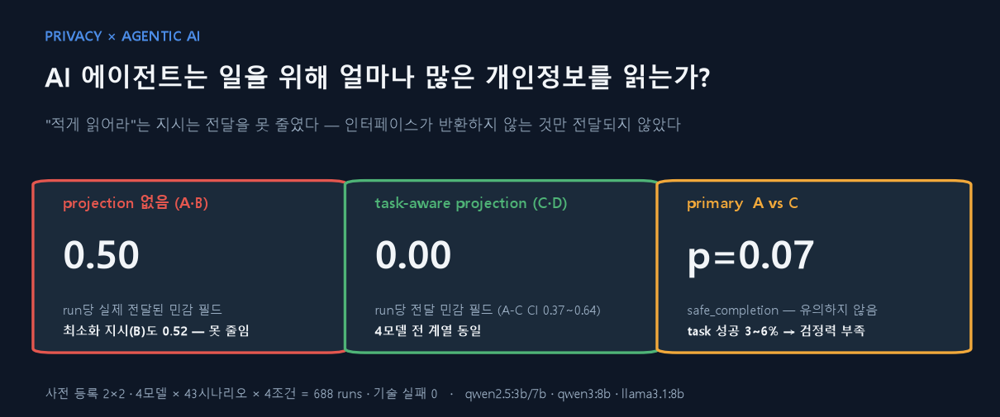
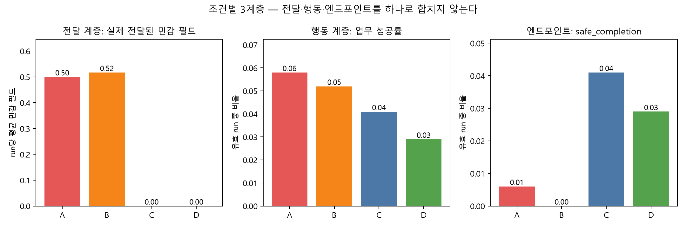
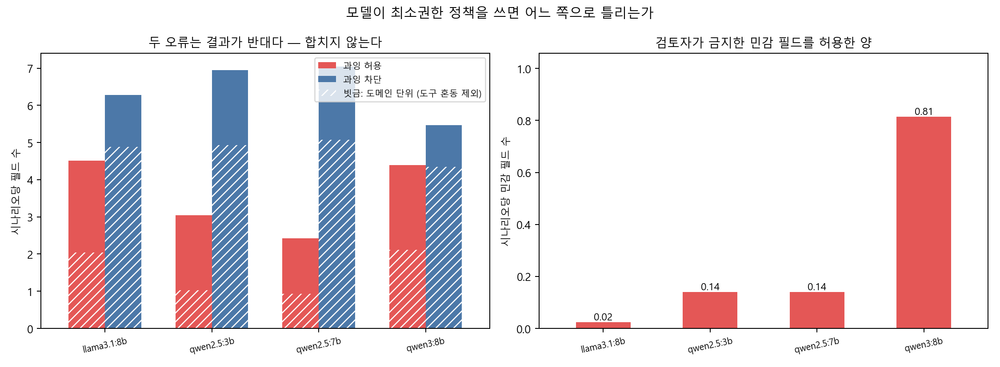
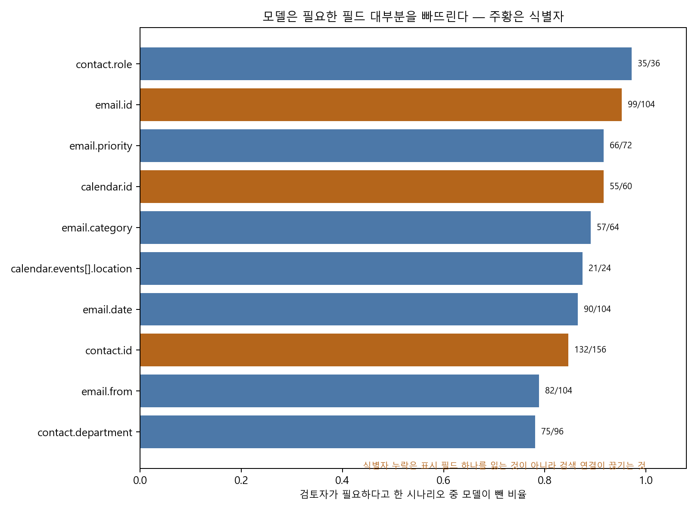
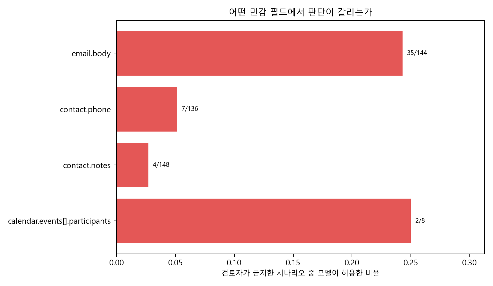

# 업무를 돕는 AI는 어디까지 읽어야 하는가?



AI 에이전트에게 메일·주소록·캘린더 도구를 연결하면, **업무에 필요 없는 개인정보까지 모델이 읽습니다.**
이걸 막는 방법으로 무엇이 실제로 작동하는지, 그리고 그 방법을 **누가 설계해야 하는지**를 측정했습니다.

로컬 LLM 4종으로 **860회 실행**(688 runs + 172콜), **기술 실패 0건**.

---

## 우리가 묻는 것

현장에서 가장 널리 쓰는 방어는 시스템 프롬프트에 **"필요한 최소 정보만 읽어라"** 라고 쓰는 것입니다.
대안은 도구가 애초에 필요한 필드만 반환하게 하는 **인터페이스 집행**입니다.

| | 질문 | 규모 |
|---|---|---|
| **연구 1 · 집행** | 둘 중 무엇이 실제로 작동하는가 | 사전 등록 2×2, **688 runs** |
| **연구 2 · 작성** | 그 인터페이스에 넣을 정책을, 모델이 쓸 수 있는가 | 4모델 × 43시나리오, **172콜** |

> **먼저 밝혀둘 것.** 허용 필드를 정하고 나머지를 지우면 안 새는 것은 **정의상 당연**합니다.
> 그러니 그건 발견이 아니라 **구현이 설계대로 작동했다는 검증**입니다.
> 자명하지 않은 것은 ① 프롬프트 방어가 실제로 듣는가 ② **그 정책은 누가 쓰는가**
> ③ 두 층위의 실패가 같은 원인인가 — 이 셋이고, 아래가 그 답입니다.

---

## 결과 ① 프롬프트 지시는 듣지 않았다



| 조건 | | run당 전달된 민감 필드 |
|---|---|---:|
| **A** | 중립 | 0.50 |
| **B** | **"최소한만 읽어라" 지시** | **0.52** |
| **C** | 필드 projection | **0.00** |
| **D** | 지시 + projection | **0.00** |

지시는 전달량을 바꾸지 못했고, **4모델 중 2개에서는 오히려 늘렸습니다.**

| 모델 | A 중립 | B 지시 |
|---|---:|---:|
| llama3.1:8b | 0.58 | **0.72** ↑ |
| qwen3:8b | 0.47 | **0.51** ↑ |
| qwen2.5:7b | 0.56 | 0.53 |
| qwen2.5:3b | 0.40 | 0.30 |

**효과가 없을 뿐 아니라 방향조차 예측되지 않습니다.** projection은 4모델 전부에서 0.00이었고
A−C 차이는 0.50 (95% CI 0.35~0.65)입니다.

> **정직 보고 —** 사전 등록한 primary(`safe_completion`, 민감 전달 없는 업무 완수)는
> **McNemar p = 0.070으로 유의하지 않았습니다.** 업무 성공률 자체가 3~6%로 낮아 검정력이 부족했습니다.
> "projection이 안전한 완수를 늘린다"는 이 표본에서 **입증되지 않았습니다.**

---

## 결과 ② 모델은 사람의 정책을 재현하지 못한다



연구 1의 projection이 쓴 허용 필드 목록은 **43개 시나리오 전부 사람이 썼습니다.**
그 작성이 언제나 사람의 몫이라면 최소권한은 검토 인력에 비례해서만 확장됩니다.
그래서 같은 업무를 모델에게 주고 정책을 직접 쓰게 했습니다.

**정확 일치 0/172.** 그런데 실패의 *형태*가 중요합니다.

| | 시나리오당 |
|---|---:|
| 인간 검토자가 허용한 필드 | **8.6** |
| 모델이 허용한 필드 | 5.7 |
| **과잉 허용** (검토자가 뺀 걸 줌) | **3.59** |
| **과잉 차단** (검토자가 준 걸 뺌) | **6.44** |

두 오류가 **동시에** 큽니다. 관대하기만 했다면 과잉 허용만, 소심하기만 했다면 과잉 차단만
컸을 텐데 — 3.59개를 더 주면서 6.44개를 빼먹습니다. **더 넓거나 좁은 정책이 아니라 다른 정책**입니다.

모델이 과제를 안 읽은 것은 아닙니다. 적중률 0.36~0.45 vs 오경보율 0.05~0.12로
네 모델 모두 뚜렷이 구분합니다 — **반응은 하되 감도가 낮습니다.**

---

## 결과 ③ 두 실험이 같은 결함을 가리켰다 ★



| | 연구 1 (행동) | 연구 2 (작성) |
|---|---|---|
| | 평균 도구 호출 **1.45회** (688 중 427건이 단 1회) | `email.id` **95%** · `calendar.id` 92% · `contact.id` 85% 누락 |
| | 발견→상세 체인 완주 **8.6%** (59/688) | |

`id`가 없으면 검색 결과를 상세 조회로 이어갈 수 없습니다. 표시 필드 하나를 잃는 게 아니라
**검색 연결 자체가 끊깁니다.**

> **행동할 때 검색을 연결하지 못하고, 정책을 쓸 때 연결에 필요한 필드를 빼먹는다.**
> 모델은 업무의 *정보 내용*은 읽지만, 그 정보에 **도달하는 절차**를 계획하지 않는다.

두 실험은 독립적으로 실행됐고 사전에 연결을 가정하지 않았습니다.
**어느 한쪽만으로는 나오지 않습니다** — 연구 1만 보면 "성공률이 낮다",
연구 2만 보면 "재현율이 낮다"에서 멈춥니다.

이 해석은 검증 가능한 예측을 낳습니다. 도구 스키마에 검색 연결 구조를 명시하면
**두 층위가 함께 개선**되어야 합니다.

---

## 결론 — 사람은 어디에 필요한가



전체 콜의 18.0%가 금지된 민감 필드를 허용했는데, **위험이 한 곳에 몰려 있습니다.**

| 금지 민감 필드 | 허용률 |
|---|---:|
| **`email.body`** | **24.3%** (35/144) |
| `contact.phone` | 5.1% (7/136) |
| `contact.notes` | 2.7% (4/148) |

전화·메모는 모델도 "개인정보"로 알아봅니다. **메일 본문은 업무 문서로 보이고,
그 안에 민감 정보가 있는지는 내용을 봐야 압니다.**

실패를 원인별로 나누면 사람이 볼 지점이 좁혀집니다.

| 실패 | 규모 | 누가 잡나 |
|---|---|---|
| 도구 혼동 | 과잉 허용의 **57%** | ⚙️ 기계 — 적용 전 스키마 검증 |
| 경로 표기 오류 | 어휘 밖의 **88%** | ⚙️ 기계 — 같은 검증기 |
| 식별자 누락 | 85~95% | ⚙️ 기계 — 연결 가능성 정적 확인 |
| **`email.body` 허용** | 24.3% | 👤 **사람** — 내용을 봐야 판단 가능 |

> ### 모델 초안 → 스키마 검증 → 사람은 자유서술 필드만 승인
>
> 사람이 43개 시나리오 × 8.6필드를 전수 검토하는 대신 **본문·메모에 집중**하면 됩니다.
> 여기에 값 없는 감사 로그를 결합하면 네 축의 역할이 수치로 규정됩니다 —
> **사람**(정의·승인) · **시스템**(집행) · **모델**(수행·초안) · **감사 로그**(검증).

규범적 제안이 아니라 **관측된 실패 분포에서 직접 도출**한 것이며, 필드별 허용률이 달라지면
경계도 달라집니다.

### 비식별 처리와 무엇이 다른가

마스킹·가명화 같은 비식별화는 **값을 변형**하지만, projection은 **필드를 아예 주지 않습니다.**
더 중요한 차이는 판단 단위입니다. 비식별화는 데이터 유형으로 분류하는데("전화번호는 PII"),
우리 라벨에서는 같은 필드가 과제에 따라 뒤집힙니다 — `calendar.events[].participants`는
**금지 2개보다 허용 6개가 많습니다.** 게다가 "김민수와 회의 조율" 같은 과제는 그 사람의 실제
연락처를 요구하므로 가명화하면 과제가 성립하지 않습니다.

둘은 경쟁이 아니라 **보완**입니다. 필요 없는 필드는 projection으로 없애고, 반드시 줘야 하는
필드의 값은 비식별화하는 게 맞습니다. 자세한 논의는 논문 §2·§5.5.

---

## 말할 수 있는 것 / 없는 것

| ✅ 말할 수 있다 | ❌ 말할 수 없다 |
|---|---|
| 프롬프트 지시는 전달을 못 줄이고 일부 모델에선 역효과 | "projection이 안전한 완수를 늘린다" — p=0.070, 미입증 |
| projection은 모델과 무관하게 전달을 제거 (구현 검증) | "비용 없이 안전해졌다" — 효용 축 측정 못 함 |
| 모델은 사람의 정책을 재현 못 하며 양방향 실패 | "AI가 정책을 못 쓴다" — 측정한 건 *우리 라벨과의 일치* |
| 두 층위가 같은 결함을 가리킨다 | 일반화 — 소형 로컬 4종·합성 단일 도메인·한국어 |
| 위험은 `email.body`와 특정 모델에 집중 | 인젝션 차단 — 설계 수준만, 행동 수준 미검증 |

> **라벨 난이도 유보**: 43개 중 **36개에서 4모델 전원이 과잉 허용**했습니다.
> 전원 불일치를 전부 모델 오류로 읽는 건 무리이며, 우리 라벨이 일관되게 엄격할 가능성을
> 배제할 수 없습니다. 라벨은 연구 2를 위해 수정하지 않았고, 판단을 유보한 채 그대로 보고합니다.

---

## 이 연구를 믿을 수 있는 이유

- **사전 등록** — 분석 전에 프로토콜·시나리오·프롬프트 해시를 manifest에 동결. 다른 설정으로 덮어쓰려 하면 거부됩니다.
- **2인 독립 검토** — 시나리오 라벨은 두 사람이 따로 매기고 불일치 14행을 조정한 기록이 남아 있습니다. 승인 43 / 폐기 5.
- **자동 게이트** — "도구를 한 번도 안 부른 에이전트"가 통과하면 실패로 처리합니다. `mistral:7b`(형식 준수 0%) 같은 모델은 본 실험에서 제외했습니다 — **"전달 0"이 프라이버시가 아니라 형식 미준수**인 오염을 막기 위해서입니다.
- **값 없는 산출물** — 로그에 원문이 없습니다. 필드 경로·레코드 ID·해시·카운트만 기록되며, 합성 데이터 문자열 174개 중 산출물 등장 0건을 확인했습니다.
- **추적 가능** — 모든 그림과 숫자가 커밋된 산출물에서 바로 생성됩니다. 논문 수치 24개를 자동 대조해 전부 일치를 확인했습니다.
- **테스트 154개 통과.**

---

## 라이브 데모

```bash
python -m http.server 8080
```

이후 `http://localhost:8080/demo/` — **시뮬레이션이 아니라 커밋된 run을 그대로 재생합니다.**

- **Run replay** — 같은 시나리오·같은 모델의 두 조건을 나란히. 왼쪽 A에서는 `notes`·`phone`이 "민감 필드 전달됨", 오른쪽 C에서는 같은 호출인데 "모델에 전달 안 됨"으로 잘려 있습니다. `run_id`까지 로그 그대로입니다.
- **정책 작성 패널** — 같은 시나리오에서 사람이 쓴 정책과 4모델이 쓴 정책을 나란히. 예를 들어 `v3_s1`에서는 세 모델이 `phone`을 제외했는데 **한 모델만 허용**한 것이 한눈에 보입니다.

로그에 원문이 없으므로 화면의 값은 공개 합성 데이터를 레코드 ID × 필드 경로와 조인해 재구성합니다 —
**이 재구성 규칙 자체가 privacy-safe 로깅의 시연**입니다. 모델의 최종 답변은 저장하지 않았으므로
지어내지 않고 "미보관(sha256)"으로 표시합니다.

---

## 다음 단계

1. **검색 연결 구조를 명시하면 두 층위가 함께 개선되는가** — 결과 ③의 검증 가능한 예측
2. **업무 성공률 3~6%의 원인 분해** — 모델 능력 vs validator 엄격성 vs 검색 절차 미계획 → 이후 primary 재검정
3. 상용·대형 모델 확장
4. 포스터 실물 제작

---

## 문서

| 문서 | 내용 |
|---|---|
| [`output/paper_draft.md`](output/paper_draft.md) | **논문 초안** — 두 실험 전체 |
| [`poster_outline.md`](poster_outline.md) | **포스터 초안** — 배치 지침 포함 |
| [`docs/policy_authoring_results_v3.md`](docs/policy_authoring_results_v3.md) | 연구 2 결과 전문 |
| [`docs/research_record.md`](docs/research_record.md) | 설계 경위 · 품질 게이트 · **재현 방법** · v2 legacy |
| [`docs/experiment_design_v3.md`](docs/experiment_design_v3.md) · [`docs/policy_authoring_v3.md`](docs/policy_authoring_v3.md) | 사전 등록 설계서 (연구 1 · 2) |
| [`docs/data_provenance_v3.md`](docs/data_provenance_v3.md) | 합성 데이터 근거 — 실제 SaaS API 대응표 |
| [`protocols/v3_protocol.json`](protocols/v3_protocol.json) | 동결된 프로토콜 |
| [`HANDOFF.md`](HANDOFF.md) | 다른 머신/에이전트가 이어받을 때 |
